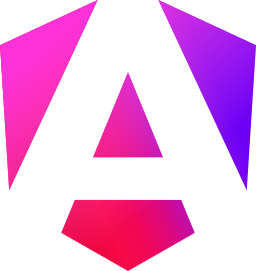

    

- 👩‍💻 I am a full-stack developer specializing in industrial software.
- 🌱 Learning more deeply about **Software Architecture**, **Software Engineering** and **Spec-driven development (SDD)**.
- 🎓 Undergraduate degree in Analysis and Systems Development.
- 💡 Love a good challenge and innovative ideas.

    <h2>📊 My Stats</h2>
    
    

    <h2>💻 Tech Stack</h2>
    
    
    
    
    

