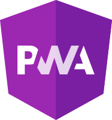

    <h1>👋 Hello! My name is Gabriel.</h1> 

I am a recent graduate in Analysis and Systems Development, carrying with me a passion for learning and the ambition to contribute with my skills in an environment that values professional growth.

## 📊 My Stats

    
    

## 😎 Main Skills

    
    
    
    
    
    
    
    
    
      
    
    

### 💻 Programming Languages

    
    
    
    

## 📲 Social

    
    <h4>&copy; Gabriel de Souza.</h4>

